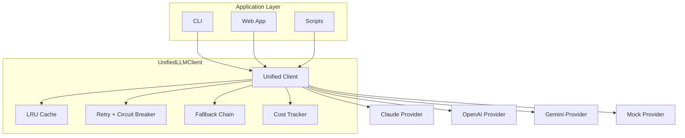

[](https://github.com/sponsors/ChunkyTortoise)

# LLM Integration Starter Kit

[](https://ct-llm-starter.streamlit.app)
[](https://github.com/ChunkyTortoise/llm-integration-starter/actions)
[](https://www.python.org/downloads/)
[](https://opensource.org/licenses/MIT)
[]()

**A beginner-friendly learning kit for integrating multiple LLM providers with a unified interface.**

This is a **code-as-documentation** project designed to teach LLM integration patterns through heavily commented, production-quality code. Perfect for developers learning to work with Claude, OpenAI, Gemini, and other LLM APIs.

## What This Solves

- **Provider sprawl** — One consistent client across Claude, OpenAI, and Gemini
- **Missing production patterns** — Retries, circuit breakers, caching, and cost tracking included
- **Learning curve** — Heavily commented modules that explain the why, not just the what

## Key Metrics

| Metric | Value |
|--------|-------|
| Tests | **220 passing** |
| Providers | 4 (Claude, OpenAI, Gemini, Mock) |
| Circuit Breaker Recovery | Configurable half-open probes, auto-reset |
| Fallback Latency | Provider chain failover with error accumulation |
| Batch Throughput | CLI benchmark mode (`--n-requests`) |
| Cache | LRU with TTL, hit-rate tracking |
| Dependencies | 3 (httpx, click, pydantic) |

## Demo

Live demo: https://ct-llm-starter.streamlit.app

## Why This Project?

While production orchestrators like [LangChain](https://github.com/langchain-ai/langchain) and [ai-orchestrator](https://github.com/ChunkyTortoise/ai-orchestrator) are powerful, they can be overwhelming for beginners. This starter kit focuses on:

- **Educational clarity**: Every module is heavily commented to explain *why*, not just *what*
- **Core patterns only**: No framework bloat—just the essential patterns you need
- **Cross-provider abstraction**: Learn to build provider-agnostic interfaces
- **Real-world concerns**: Caching, retries, circuit breakers, cost tracking

## Features

```
┌─────────────────────────────────────────────────────────┐
│                   UnifiedLLMClient                      │
│  Single interface for multiple LLM providers            │
└────────────┬────────────────────────────────────────────┘
             │
      ┌──────┴──────┐
      │   Providers  │
      │  - Claude    │
      │  - OpenAI    │
      │  - Gemini    │
      │  - Mock      │
      └──────┬──────┘
             │
   ┌─────────┼─────────┐
   │         │         │
┌──▼──┐  ┌──▼──┐  ┌──▼──┐
│Cache│  │Retry│  │Cost │
│ LRU │  │ +CB │  │Track│
└─────┘  └─────┘  └─────┘

Legend: CB = Circuit Breaker
```

### Core Capabilities

- **Unified Client**: One interface for all providers
- **Function Calling**: Cross-provider tool use abstraction
- **Streaming**: SSE parser for real-time responses
- **Retry Logic**: Exponential backoff with jitter
- **Circuit Breaker**: Auto-recovery from cascading failures
- **Fallback Chains**: Provider redundancy for high availability
- **LRU Cache**: In-memory caching with TTL
- **Cost Tracking**: Per-provider cost monitoring
- **CLI**: Command-line tool for testing and benchmarking

## Quick Start

### Installation

```bash
# Clone the repository
git clone https://github.com/ChunkyTortoise/llm-integration-starter.git
cd llm-integration-starter

# Install dependencies
pip install -e .
pip install -r requirements-dev.txt

# Copy environment template
cp .env.example .env
# Edit .env with your API keys
```

### Basic Usage

```python
from llm_integration_starter import UnifiedLLMClient

# Create a client (defaults to mock provider for testing)
client = UnifiedLLMClient(provider="mock")

# Send a message
messages = [{"role": "user", "content": "What is 2+2?"}]
response = client.complete(messages)

print(f"Response: {response.text}")
print(f"Cost: ${response.cost:.4f}")
print(f"Latency: {response.latency_ms:.0f}ms")
```

### CLI Examples

```bash
# Chat with a provider
llm-starter chat "Hello, world!"

# Compare providers
llm-starter compare --providers claude,openai "Explain AI"

# Benchmark performance
llm-starter benchmark --provider mock --n-requests 100

# Test fallback chain
llm-starter fallback --providers claude,openai,gemini "Hello"
```

## Module Guide

### 📦 `client.py` - Unified Interface
The heart of the starter kit. Provides a single API for all providers.

**Key Classes:**
- `UnifiedLLMClient`: Main client class
- `LLMResponse`: Standardized response format

**Learning Points:**
- Provider registry pattern
- Response normalization
- Dependency injection

### 🎭 `providers/` - Provider Implementations
Each provider implements the `BaseProvider` interface.

**Providers:**
- `mock.py`: Deterministic testing provider (no API needed)
- `claude.py`: Anthropic Claude integration
- `openai_provider.py`: OpenAI GPT integration
- `gemini.py`: Google Gemini integration

**Learning Points:**
- Abstract base classes
- Interface segregation
- Provider-specific handling

### 🌊 `streaming.py` - Server-Sent Events
Parse SSE streams from different providers into a common format.

**Key Classes:**
- `StreamingParser`: Provider-agnostic SSE parser
- `StreamDelta`: Single token/chunk from stream

**Learning Points:**
- SSE protocol basics
- Event stream processing
- Provider format differences

### 🛠️ `function_calling.py` - Tool Use Abstraction
Normalize function calling across providers.

**Key Classes:**
- `ToolDefinition`: Provider-agnostic tool schema
- `ToolCall`: Parsed tool call from LLM
- `FunctionCallingFormatter`: Format converter

**Learning Points:**
- JSON Schema for parameters
- Provider format translation
- Function call lifecycle

### 🔄 `retry.py` - Resilience Patterns
Exponential backoff and circuit breaker for fault tolerance.

**Key Classes:**
- `RetryPolicy`: Configurable retry behavior
- `CircuitBreaker`: Failure tracking with auto-recovery

**Learning Points:**
- Exponential backoff algorithm
- Jitter for load distribution
- Circuit breaker state machine
- Graceful degradation

### 🔗 `fallback.py` - Provider Redundancy
Try providers in sequence for high availability.

**Key Classes:**
- `FallbackChain`: Sequential provider failover
- `FallbackResult`: Success tracking with errors

**Learning Points:**
- Failover strategies
- Error accumulation
- Provider ordering

### 💾 `cache.py` - Response Caching
LRU cache with TTL to reduce costs and latency.

**Key Classes:**
- `LRUCache`: Least-recently-used cache

**Learning Points:**
- LRU eviction policy
- TTL expiration
- Cache key generation

## Service Mapping

- Service 6: AI-Powered Personal and Business Automation
- Service 5: Prompt Engineering and System Optimization

## Certification Mapping

- IBM Generative AI Engineering with PyTorch, LangChain & Hugging Face
- Duke University LLMOps Specialization
- Vanderbilt Generative AI Strategic Leader Specialization
- Google Cloud Generative AI Leader Certificate
- Hit rate tracking

### 💰 `cost_tracker.py` - Usage Monitoring
Track and analyze LLM usage costs over time.

**Key Classes:**
- `CostTracker`: Cost aggregation and analysis
- `CostEntry`: Single usage record

**Learning Points:**
- Cost estimation
- Usage analytics
- Time-based queries

### 🖥️ `cli.py` - Command-Line Interface
Interactive CLI built with Click.

**Commands:**
- `chat`: Single message to provider
- `compare`: Side-by-side comparison
- `benchmark`: Performance testing
- `fallback`: Test fallback chains

**Learning Points:**
- CLI design patterns
- Progress bars
- Result formatting

## Architecture Diagram



<details>
<summary>ASCII version</summary>

```
┌───────────────────────────────────────────────────────────┐
│                      Application Layer                     │
│  ┌──────────────┐  ┌──────────────┐  ┌──────────────┐    │
│  │     CLI      │  │  Web App     │  │   Scripts    │    │
│  └──────┬───────┘  └──────┬───────┘  └──────┬───────┘    │
└─────────┼──────────────────┼──────────────────┼───────────┘
          │                  │                  │
          └──────────────────┼──────────────────┘
                             │
┌────────────────────────────▼──────────────────────────────┐
│                   UnifiedLLMClient                         │
│  ┌──────────┐  ┌──────────┐  ┌──────────┐  ┌──────────┐ │
│  │  Cache   │  │  Retry   │  │Fallback  │  │   Cost   │ │
│  │  Layer   │  │  Logic   │  │  Chain   │  │ Tracker  │ │
│  └──────────┘  └──────────┘  └──────────┘  └──────────┘ │
└────────────────────────────┬──────────────────────────────┘
                             │
          ┌──────────────────┼──────────────────┐
          │                  │                  │
┌─────────▼─────────┐ ┌──────▼──────┐ ┌────────▼────────┐
│ ClaudeProvider    │ │OpenAIProvider│ │ GeminiProvider  │
│                   │ │              │ │                 │
│ • Messages API    │ │ • Chat API   │ │ • Generate API  │
│ • Streaming       │ │ • Functions  │ │ • Tools         │
│ • Tools           │ │ • Streaming  │ │ • Streaming     │
└───────────────────┘ └──────────────┘ └─────────────────┘
```

</details>

## Architecture Decisions

| ADR | Title | Status |
|-----|-------|--------|
| [ADR-0001](docs/adr/0001-circuit-breaker-pattern.md) | Circuit Breaker Pattern | Accepted |
| [ADR-0002](docs/adr/0002-fallback-chain-design.md) | Fallback Chain Design | Accepted |
| [ADR-0003](docs/adr/0003-response-caching-strategy.md) | Response Caching Strategy | Accepted |

## Test Coverage

**220 tests across 9 test files:**

| Module | Tests | Coverage |
|--------|-------|----------|
| `client.py` | 12 | Core functionality |
| `providers/` | 12 | Mock provider + base class |
| `streaming.py` | 12 | SSE parsing |
| `function_calling.py` | 12 | Tool formatting & parsing |
| `retry.py` | 10 | Retry logic + circuit breaker |
| `fallback.py` | 8 | Fallback chain logic |
| `cache.py` | 12 | LRU cache + TTL |
| `cost_tracker.py` | 11 | Cost tracking & analytics |
| `cli.py` | 7 | CLI commands |

```bash
# Run tests
make test

# Run tests with coverage report
python -m pytest tests/ -v --cov=llm_integration_starter --cov-report=html
open htmlcov/index.html
```

## Development

```bash
# Install in development mode
make install

# Format code
make format

# Lint code
make lint

# Run tests
make test

# Clean build artifacts
make clean
```

## Comparison: Starter Kit vs Production Tools

| Feature | This Starter Kit | ai-orchestrator | LangChain |
|---------|------------------|-----------------|-----------|
| **Purpose** | Learning & education | Production orchestration | Production framework |
| **Code Style** | Heavily commented | Production-ready | Framework architecture |
| **Complexity** | Low (11 modules) | Medium (async, multi-agent) | High (100+ modules) |
| **Dependencies** | 3 (httpx, click, pydantic) | ~8 | 20+ |
| **Best For** | Understanding patterns | Building orchestrators | Full-featured apps |

## When to Use This vs ai-orchestrator

**Use this starter kit when:**
- You're learning LLM integration patterns
- You want to understand how things work under the hood
- You're building a simple integration from scratch
- You need educational reference code

**Use ai-orchestrator when:**
- You need production-ready multi-agent orchestration
- You require async/await for concurrency
- You're building complex agentic workflows
- You need battle-tested reliability patterns

**Use LangChain when:**
- You need a full-featured framework
- You're building a complex RAG system
- You want pre-built chains and agents
- You need extensive provider integrations

## Learning Path

1. **Start with `providers/mock.py`**: Understand the provider interface without API calls
2. **Read `client.py`**: Learn the unified client pattern
3. **Study `streaming.py`**: Understand SSE parsing
4. **Explore `function_calling.py`**: Learn tool use abstraction
5. **Review `retry.py` & `fallback.py`**: Learn resilience patterns
6. **Implement `cache.py`**: Understand caching strategies
7. **Track with `cost_tracker.py`**: Learn usage monitoring
8. **Try the `cli.py`**: Interactive experimentation

## Benchmarks

See [BENCHMARKS.md](BENCHMARKS.md) for performance benchmarks across providers, caching, and retry scenarios.

## Changelog

See [CHANGELOG.md](CHANGELOG.md) for release history.

## Related Projects

- [ai-orchestrator](https://github.com/ChunkyTortoise/ai-orchestrator) -- AgentForge: unified async LLM interface (Claude, Gemini, OpenAI, Perplexity)
- [EnterpriseHub](https://github.com/ChunkyTortoise/EnterpriseHub) -- Real estate AI platform with BI dashboards and CRM integration
- [prompt-engineering-lab](https://github.com/ChunkyTortoise/prompt-engineering-lab) -- 8 prompt patterns, A/B testing, TF-IDF evaluation
- [Portfolio](https://chunkytortoise.github.io) -- Project showcase and services

## Contributing

Contributions welcome! This is a learning project, so:
- Prioritize clarity over cleverness
- Add detailed comments explaining *why*
- Include examples in docstrings
- Write comprehensive tests

## License

MIT License - see [LICENSE](LICENSE) for details.

## Author

**ChunkyTortoise**
- GitHub: [@ChunkyTortoise](https://github.com/ChunkyTortoise)
- Portfolio: [chunkytortoise.github.io](https://chunkytortoise.github.io)

## Acknowledgments

Built as a companion to my production LLM orchestration work. Inspired by the need for beginner-friendly, well-documented LLM integration examples.

---

**⭐ Star this repo** if you find it helpful for learning LLM integration!
